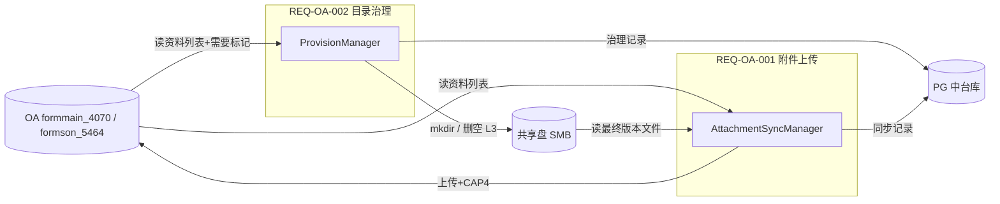

# REQ-OA-002 国内登记共享盘目录自动维护

---

## 1. 基本信息

| 项目 | 内容 |
|------|------|
| 需求编号 | REQ-OA-002 |
| 需求标题 | 国内登记报告「资料列表」驱动共享盘目录自动创建与清理 |
| 需求类型 | feature |
| 所属系统 | oa / platform |
| 优先级 | P1(高) |
| 状态 | drafting |
| 提出人 | — |
| 提出日期 | 2026-07-30 |
| 负责人 | — |
| 预计上线 | 待定 |
| **关联需求** | [REQ-OA-001 国内登记报告资料列表附件上传](./REQ-OA-001-国内登记报告资料列表附件上传.md) |
| **确认方案** | **OA 为期望态 + 共享盘目录探测 + 按需创建 L3 + 空目录安全删除** |

---

## 2. 需求背景

REQ-OA-001 已实现「共享盘 → OA」附件上传：业务在共享盘按规范目录存放资料，中台定时读取并上传至 OA 资料列表「附件」列。

当前仍存在以下问题：

1. OA 新建或变更国内登记资料列表后，共享盘上**未必已存在规范目录**，负责人需手工建文件夹，易漏建、命名不一致；
2. 资料项标记为「不需要」后，共享盘上**空目录仍残留**，干扰扫描与人工识别；
3. REQ-OA-001 当前**不读取「需要」字段**，全部资料行均参与附件扫描，与业务「不需要则不放资料」的规则不一致。

**目标**：

1. 从 OA 读取国内登记信息及资料列表（含「需要 / 不需要」标记）；
2. 按 **登记负责人 + IPDP 项目名称（项目编号）+ 资料项目名称** 与共享盘对齐；
3. 目录不存在时按规范**自动创建**（L1 → L2 → L3）；
4. 资料项为「不需要」时**不创建** L3；若 L3 已存在且**为空**则**删除**；**非空不删**；
5. 与 REQ-OA-001 附件同步**分任务调度**，目录治理优先于附件上传执行。

---

## 3. 确认方案概述

### 3.1 方案说明

```
OA 数据库              集成中台                    共享盘（SMB）
  │                    │                          │
  │  ① SQL 查 formmain_4070│                          │
  │     + formson_5464  │                          │
  │     （含「需要」）   │                          │
  │  ─────────────────→│                          │
  │                    │  ② 计算期望路径 L1/L2/L3   │
  │                    │  ③ exists / isEmpty       │
  │                    │  ───────────────────────→│
  │                    │  ④ mkdir / 删空 L3        │
  │                    │  ←───────────────────────│
  │                    │  ⑤ 写 PG 治理记录         │
```

| 角色 | 职责 |
|------|------|
| **登记负责人（业务）** | 在 OA 维护资料列表及「需要 / 不需要」；在共享盘 L3 目录存放资料文件 |
| **致远 OA 数据库** | 提供 formmain_4070 / formson_5464 只读查询（含「需要」字段） |
| **集成中台** | 读 OA、计算期望路径、探测共享盘、创建缺失目录、删除空 L3、记治理状态 |
| **共享盘** | 目录实际载体；中台需 **读 + 建目录 + 删空目录** 权限 |
| **PG 中间表** | 记录目录治理动作（创建 / 删除 / 跳过），可审计、可查询 |

### 3.2 核心原则

| 原则 | 说明 |
|------|------|
| OA 为期望态 | 以 OA 资料列表为准，决定哪些 L3 应存在、哪些应清理 |
| 与附件同步互补 | REQ-OA-002：OA → 共享盘（目录）；REQ-OA-001：共享盘 → OA（文件） |
| 路径规范一致 | L1/L2/L3 命名与 REQ-OA-001 §4.2 完全一致 |
| 按需建 L3 | 仅「需要」的资料项创建 L3；「不需要」不建 |
| 安全删除 | 仅删除「不需要」且**空**的 L3；含任意文件或子目录则不删 |
| 不迁移动产 | 不自动重命名、不移动已有非空目录；OA 改名导致路径变化另议 |
| 不回写 OA | 不修改 OA 任何字段（含「完成时间」） |
| 失败可重试 | 单条失败不阻断批次；记录 FAILED，下轮重试 |

### 3.3 与 REQ-OA-001 的关系



**联动建议**：

| 场景 | 建议 |
|------|------|
| 资料项「不需要」 | REQ-OA-001 **跳过**该 L3 扫描与上传（修订 REQ-OA-001 B2） |
| 任务调度顺序 | 目录治理 **先于** 附件同步（如治理 03:00，上传 04:00） |
| 手工在「不需要」目录放文件 | 治理任务不删；附件同步也不处理 |

---

## 4. 业务对象与目录规范

### 4.1 OA 字段映射

**主表 formmain_4070**（与 REQ-OA-001 一致）

| 业务含义 | OA 字段 | 示例值 | 用途 |
|----------|---------|--------|------|
| 登记负责人 | **field0223** | 杨燕玲 | 共享盘 L1 目录 |
| IPDP 名称 | **field0160** | 21% 环丙氟虫胺·螺虫乙酯可分散液剂 (6+15) | 共享盘 L2 名称段 |
| IPDP 项目编号 | **field0164** | IPDP-202605-107 | 共享盘 L2 括号内编号 |

**子表 formson_5464**

| 业务含义 | OA 字段 | 示例值 | 用途 |
|----------|---------|--------|------|
| 资料项目 | **field0214** | 农药登记变更申请表 | 共享盘 L3 目录 |
| **需要** | **待确认 field02xx** | 需要 / 不需要 | **本需求核心判定字段** |
| 资料附件 | **field0218** | 文件 ID | 本需求只读（辅助判断，见 §5.3） |
| 子表行 ID | **id** | — | 日志追踪 |

> **子表关联（已确认）**：`formson_5464.formmain_id = formmain_4070.id`

> **匹配规则**：与 REQ-OA-001 一致，按 **登记负责人 + IPDP 名称 + IPDP 项目编号（field0164）+ 资料项目名称** 定位 L3。

### 4.2 共享盘目录结构

与 REQ-OA-001 §4.2 完全一致：

```
\\192.168.1.8\国内登记资料\                         ← 共享盘根路径
└── {登记负责人}/                               ← L1，field0223
    └── {IPDP名称（项目编号）}/                 ← L2，field0160 + field0164
        └── {资料项目名称}/                     ← L3，field0214
            ├── xxx_最终版本.pdf
            └── ...
```

**L2 命名规范**：

| 项 | 说明 |
|----|------|
| 格式 | `{field0160 IPDP名称，可含括号}（{field0164 项目编号}）` |
| 项目编号位置 | **最后一对**括号内为 field0164；名称段可含配方括号如 `(6+15)` |
| 括号 | 默认中文括号 `（）`；磁盘已有英文括号时 REQ-OA-001 扫描侧兼容 |
| 项目编号 | 以 OA `field0164` 原文为准，不限制格式 |

**完整路径示例**：

```
\\192.168.1.8\国内登记资料\李庆辉\21%环丙氟虫胺·螺虫乙酯可分散液剂 (6+15)（IPDP-202605-107）\农药登记申请表\
```

### 4.3 「需要 / 不需要」判定

> **字段物理名仍待 OA 确认**（见 §14.1 B-1、§14.3 O-1）；**空值默认规则已确认**（见 §14.1 B-2）。

| OA 存储值 | 语义 | 目录行为 |
|-----------|------|----------|
| 需要 | 需要该资料 | 缺则建 L3（及所需 L1/L2） |
| 不需要 | 不需要该资料 | 不建 L3；已存在且空则删 L3 |
| **空值 / NULL / 空白** | **视为「需要」**（**已确认**） | 与「需要」相同：缺则建 L3；**不执行空目录删除** |

**空值默认「需要」（已确认 B-2）**：

| 项 | 说明 |
|----|------|
| 适用范围 | OA 子表「需要」列为 `NULL`、空字符串或仅空白字符 |
| 归一化 | 读取后统一视为 **需要**（`itemRequired = true`），再进入 §5.2 创建/删除分支 |
| 建目录 | 与显式「需要」一致，缺则建 L1/L2/L3 |
| 删目录 | **不**因空值触发 L3 删除；仅显式「不需要」且目录为空时才删 |
| 设计理由 | 保守策略，避免历史数据或未填字段导致误删共享盘目录 |

**实现伪代码（供开发参考）**：

```
normalizedRequired = isBlank(oaItemRequired) || equalsIgnoreCase(oaItemRequired, "需要")
if (normalizedRequired) {
    // 创建分支：L3 不存在 → mkdir
} else if (equalsIgnoreCase(oaItemRequired, "不需要")) {
    // 删除分支：L3 存在且空 → delete
}
```

---

## 5. 业务流程

### 5.1 总体流程

```
定时 / 手动触发
    │
    ▼
① OA SQL：JOIN formmain_4070 + formson_5464，拉取资料行（含「需要」标记）
    │
    ▼
② 按行计算期望路径 expectedPath（L1、L2、L3）
    │
    ▼
③ 共享盘探测：exists / list / isEmpty
    │
    ├─ 需要（含空值默认，见 §4.3）+ L3 不存在 → mkdir -p（L1 → L2 → L3）→ 记 CREATED
    ├─ 需要（含空值默认）+ L3 已存在 → 记 SKIPPED_EXISTS
    ├─ 不需要 + L3 不存在 → 记 SKIPPED_NOT_REQUIRED
    └─ 不需要 + L3 已存在
           ├─ 空目录 → 删除 L3 → 记 DELETED
           └─ 非空   → 不删 → 记 SKIPPED_NOT_EMPTY（INFO/WARN 日志）
    │
    ▼
④ 写 PG 治理记录
    │
    ▼
⑤ 输出本轮统计；异常项可选企微告警
```

### 5.2 创建规则

| 层级 | 创建条件 |
|------|----------|
| L1 | 该项目下**至少有一条「需要」（含空值默认）**的资料行 |
| L2 | 同上（同一 formMainId / 同一 field0164 项目） |
| L3 | **该行「需要」（含空值默认）** 且 L3 路径不存在 |

- 创建顺序：**L1 → L2 → L3**（逐级 `mkdir`，父级已存在则跳过）。
- 同一 L2 下多条「需要」资料项：共用一个 L2，分别建多个 L3。
- **「不需要」的行：永不创建 L3**（空值不归入「不需要」，见 §4.3）。

### 5.3 删除规则（仅 L3）

| 条件 | 动作 |
|------|------|
| 「不需要」 + L3 **不存在** | 无操作 |
| 「不需要」 + L3 **存在且为空** | **删除 L3 目录** |
| 「不需要」 + L3 **存在且非空** | **不删除** |

**「空目录」定义（建议）**：

- 目录下无任何文件、无任何子目录（列举结果为空）；
- **默认**：含 `desktop.ini`、`Thumbs.db` 等系统文件视为**非空**（更安全）；
- 是否忽略系统文件名单：**待确认 B-3**。

**安全约束**：

- **禁止**递归删除 L2 / L1；
- **禁止**删除含 `_最终版本` 或任意普通文件的目录；
- 删除前**二次列举**确认为空（降低并发误删风险）。

### 5.4 拉取范围

与 REQ-OA-001 一致：

| 模式 | 说明 |
|------|------|
| 全量定时 | 主表 Redis 游标分批（formmain_4070.id） |
| 单表触发 | 指定 formMainId |
| 测试过滤 | 登记负责人白名单（配置项） |

### 5.5 OA 查询 SQL（草案）

```sql
SELECT
    m.id              AS form_main_id,
    m.field0223       AS owner_name,
    m.field0160       AS ipdp_name,
    m.field0164       AS ipdp_project_no,
    s.id              AS item_row_id,
    s.field0214       AS item_name,
    s.field0218       AS current_file_id,
    s.field02xx       AS item_required   -- ★ 待 OA 确认物理字段名
FROM formmain_4070 m
INNER JOIN formson_5464 s ON s.formmain_id = m.id
WHERE m.id > :lastCursorId
ORDER BY m.id, s.id
LIMIT :batchSize;
```

> field0223 若存成员 ID，JOIN org_member 取姓名，与 REQ-OA-001 一致。

---

## 6. 功能点

| 序号 | 功能点 | 描述 | 必选/可选 |
|------|--------|------|-----------|
| F1 | SQL 查 OA 资料列表 | JOIN 主表+子表，含「需要」字段 | 必选 |
| F2 | 期望路径计算 | 按 field0223 / field0160+field0164 / field0214 拼 L1/L2/L3 | 必选 |
| F3 | 共享盘目录探测 | exists、isEmpty、list | 必选 |
| F4 | 目录创建 | 按需 mkdir -p（L1→L2→L3） | 必选 |
| F5 | 空 L3 删除 | 「不需要」且空目录时删除 L3 | 必选 |
| F6 | 治理记录与幂等 | PG 记录 CREATED/DELETED/SKIPPED/FAILED | 必选 |
| F7 | 定时任务 | cron 调度，与附件任务错开 | 必选 |
| F8 | 手动触发 | 按 formMainId 或全量触发 | 可选 |
| F9 | 治理记录查询 API | 分页查询治理动作与原因 | 可选 |
| F10 | 异常告警 | 无写权限、SMB 不可用等企微通知 | 可选 |

**明确不做**：

| 项 | 说明 |
|----|------|
| L1/L2 自动删除 | 即使其下所有 L3 已删，也不自动删 L2/L1 |
| 目录重命名 / 迁移 | OA 字段变更导致路径变化时不自动搬迁旧目录 |
| 非空目录强制删除 | 「不需要」但含文件时仅跳过并记日志 |
| OA 字段回写 | 不修改 OA 任何列 |
| 附件上传 | 属 REQ-OA-001，本需求不包含 |

---

## 7. 中间表设计

**表名**：`t_integration_oa_reg_share_dir_provision`

```
t_integration_oa_reg_share_dir_provision（共享盘目录治理记录）
├─ id                      BIGINT PK
├─ form_main_id            BIGINT    -- formmain_4070.id
├─ owner_name              VARCHAR   -- field0223 登记负责人
├─ ipdp_name               VARCHAR   -- field0160 IPDP名称
├─ ipdp_project_no         VARCHAR   -- field0164 项目编号
├─ item_name               VARCHAR   -- field0214 资料项目名称
├─ item_row_id             VARCHAR   -- formson_5464.id
├─ item_required           VARCHAR   -- 需要/不需要（快照）
├─ share_path              VARCHAR   -- L3 完整路径
├─ action                  VARCHAR   -- CREATED/DELETED/SKIPPED_EXISTS/SKIPPED_NOT_EMPTY/SKIPPED_NOT_REQUIRED/FAILED
├─ action_message          VARCHAR   -- 跳过或失败原因
├─ last_provision_at       TIMESTAMP -- 最近一次治理时间
├─ created_at / updated_at / is_deleted
```

**索引建议**：

```sql
-- 按业务键查最新治理快照
INDEX idx_provision_biz_key (owner_name, ipdp_name, ipdp_project_no, item_name)
WHERE is_deleted = 0;

-- 按主表、动作查询
INDEX idx_provision_form_action (form_main_id, action);
```

---

## 8. 涉及系统与模块

| 系统 | 模块/接口 | 说明 |
|------|-----------|------|
| 共享盘 | SMB | 需 **读 + 建目录 + 删空目录** |
| **致远 OA 数据库** | formmain_4070 / formson_5464 | **只读 SELECT**（含「需要」字段） |
| 集成中台 integration | `IShareDriveClient`（扩展 mkdir/isEmpty/deleteEmpty） | 共享盘操作 |
| 集成中台 integration | `OaRegReportDbClient`（扩展查询「需要」） | OA 库只读 |
| 集成中台 manager | `IOaRegShareDirectoryProvisionManager` | 编排 |
| 集成中台 service | `IOaRegShareDirectoryProvisionService` | 治理记录 |
| 集成中台 async | `OaRegShareDirectoryProvisionTask` | 定时任务 |
| 集成中台 web | `OaRegShareDirectoryProvisionController` | 手动触发 / 查询 |
| 集成中台 dao（PG） | 治理记录 Mapper | Flyway 迁移 |
| 企微 Webhook | 告警 | 可选 |

**模块分层（遵守项目规范）**：

| 模块 | 类（建议） | 职责 |
|------|------------|------|
| integration | `ShareDriveDirectorySupport` | L2 路径格式化（复用 REQ-OA-001） |
| integration | `ShareDriveClientImpl` | exists / mkdirs / isEmpty / deleteEmptyDirectory |
| integration | `OaRegReportDbClient` | 拉取资料行 + item_required |
| manager | `OaRegShareDirectoryProvisionManagerImpl` | 创建/删除决策、统计 |
| service | `OaRegShareDirectoryProvisionServiceImpl` | 治理记录 CRUD |
| async | `OaRegShareDirectoryProvisionTask` | `@Scheduled` |
| web | `OaRegShareDirectoryProvisionController` | REST 触发与查询 |

---

## 9. 接口草案

| 方法 | 路径 | 说明 |
|------|------|------|
| POST | `/api/v1/oa/reg-reports/share-directory/provision/trigger` | 手动触发；可选 `formMainId` |
| GET | `/api/v1/oa/reg-reports/share-directory/provision/records` | 分页查询治理记录（按 owner/action/time） |

---

## 10. 配置项（草案）

```yaml
oa:
  reg-report:
    field-item-required: field02xx   # ★ 待 OA 确认「需要」字段物理名
  share-dir-provision:
    enabled: false                   # 默认关闭，test 验证后开启
    cron: "0 0 3 * * ?"              # 建议早于附件同步任务
    batch-size: 50
    owner-allowlist: []              # 测试白名单，空=全量
    ignore-system-files:             # 空目录判定时是否忽略（默认 false=不忽略）
      - desktop.ini
      - Thumbs.db
```

---

## 11. 权限与安全

| 项 | 要求 |
|----|------|
| 共享盘账号 | 需 **读 + 建目录 + 删空目录**；建议专用 AD 账号，与 REQ-OA-001 只读账号分离或升级为读写 |
| OA 库 | **只读 SELECT**（与 REQ-OA-001 相同账号即可） |
| 审计 | 所有 CREATED / DELETED 打 INFO；须含 sharePath、itemRowId |
| 并发 | 同一 L3 路径加 Redis 分布式锁，或任务内按路径串行 |
| 误删防护 | 仅删 L3；删除前二次 isEmpty；非空一律不删 |

---

## 12. 异常与边界

| 场景 | 处理 |
|------|------|
| 「需要」字段为空（NULL/空串/空白） | 视为「需要」，走创建分支；不删 L3 | 见 §4.3 B-2 |
| field0164 为空 | 跳过该项目 L2/L3 治理，记 FAILED，告警 |
| field0223 未解析为姓名 | 跳过，与 REQ-OA-001 一致 |
| L2 磁盘目录与 OA 不一致（旧格式） | 不自动迁移；仅按 OA 规则**新建**期望路径 |
| 同 field0214 多行（不同分类） | L3 目录名相同则共用；**任一行「需要」则保留 L3** |
| 删除时目录被并发写入文件 | 二次列举为非空 → 中止删除 |
| SMB 不可用 / 无写权限 | 本轮终止或单条 FAILED，企微告警 |
| 全部资料项均为「不需要」 | 不建 L1/L2；仅处理已有 L3 的空目录清理 |

---

## 13. 验收标准

| 序号 | 场景 | 预期 |
|------|------|------|
| 1 | OA 新建项目，资料项为「需要」，共享盘无对应路径 | 自动生成 L1/L2/L3，路径与 §4.2 一致 |
| 2 | 资料项改为「不需要」，L3 为空 | 下次治理任务删除该 L3 |
| 3 | 资料项为「不需要」，L3 内有文件 | 目录保留，记 SKIPPED_NOT_EMPTY，日志可查 |
| 4 | 资料项为「不需要」，L3 不存在 | 不创建 L3 |
| 4a | 「需要」字段为空，共享盘无 L3 | 视为「需要」，自动创建 L3 |
| 5 | REQ-OA-001 附件同步 | 「不需要」资料项不再扫描上传（需 REQ-OA-001 配套修订） |
| 6 | 治理记录 | POST 触发后可 GET 查询 CREATED/DELETED 等动作 |
| 7 | 幂等 | 重复执行「需要且已存在」的 L3 不重复 mkdir |

---

## 14. 待确认信息清单

> **使用说明**：请逐项向对应责任方咨询，将「确认结果」列补充完整。★ 为阻塞开发项。

### 14.1 业务规则（咨询：国内登记部 / 业务负责人）

| 编号 | 确认项 | 咨询对象 | 确认结果 | 备注 |
|------|--------|----------|----------|------|
| B-1 ★ | 「需要 / 不需要」子表字段物理名与枚举值 | 登记部 / OA 管理员 | | 阻塞 SQL |
| B-2 | ~~空值默认「需要」还是「不需要」~~ | 登记部 | **已确认：空值默认「需要」** | NULL/空串/空白均视为需要；见 §4.3 |
| B-3 | 空目录是否忽略 desktop.ini 等系统文件 | 登记部 / IT | | 默认不忽略 |
| B-4 | 「不需要但 L3 非空」是否需企微提醒负责人手动清理 | 登记部 | | |
| B-5 | 目录治理与附件同步的 cron 顺序 | 登记部 / 运维 | | 建议治理先于上传 |
| B-6 | REQ-OA-001 是否改为仅同步「需要」资料项 | 登记部 | | 建议同步修订 |

### 14.2 共享盘（咨询：IT 运维）

| 编号 | 确认项 | 咨询对象 | 确认结果 | 备注 |
|------|--------|----------|----------|------|
| S-1 ★ | 中台共享盘账号是否具备建目录、删空目录权限 | IT 运维 | | REQ-OA-001 当前为只读 |
| S-2 | 是否沿用 REQ-OA-001 同一 UNC 根路径 | IT 运维 | **`\\192.168.1.8\国内登记资料`** | 已确认 |
| S-3 | 专用读写账号或升级现有账号 | IT 运维 | | |

### 14.3 致远 OA（咨询：OA 管理员）

| 编号 | 确认项 | 咨询对象 | 确认结果 | 备注 |
|------|--------|----------|----------|------|
| O-1 ★ | 「需要」字段物理名（formson_5464） | OA 管理员 | | 如 field02xx |
| O-2 ★ | 「需要 / 不需要」存储值（中文/编码/数字） | OA 管理员 | | |
| O-3 | 同步 SQL 的 WHERE 条件（状态/时间） | OA 管理员 | | 与 REQ-OA-001 O12 对齐 |

### 14.4 集成中台（内部确认）

| 编号 | 确认项 | 确认结果 | 备注 |
|------|--------|----------|------|
| P-1 ★ | 定时任务 cron | | 默认 `0 0 3 * * ?` |
| P-2 ★ | batch-size | | 默认 50 |
| P-3 | 是否提供手动触发 API | | 建议提供 |
| P-4 | enabled 默认 false，test 验证后开启 | | |
| P-5 | Flyway 版本号 | | 待开发时递增 |

### 14.5 OA 字段映射表（待 OA 管理员填写）

| 业务含义 | 表 / 字段 | 示例值 | 已确认 |
|----------|-----------|--------|--------|
| 登记信息主表 | formmain_4070 | — | ☑ |
| 资料列表子表 | formson_5464 | — | ☑ |
| 登记负责人 | formmain_4070.**field0223** | 杨燕玲 | ☑ |
| IPDP 名称 | formmain_4070.**field0160** | 21% 环丙氟虫胺… | ☑ |
| IPDP 项目编号 | formmain_4070.**field0164** | IPDP-202605-107 | ☑ |
| 资料项目 | formson_5464.**field0214** | 农药登记变更申请表 | ☑ |
| **需要** | formson_5464.**field02xx** | 需要 / 不需要 | ☐ |
| 子表行 ID | formson_5464.**id** | — | ☑ |

---

## 15. 风险与依赖

| 风险/依赖 | 影响 | 应对措施 |
|-----------|------|----------|
| O-1 / B-1「需要」字段未确认 | 无法开发 | 优先向 OA 管理员确认 |
| 共享盘仅有只读权限 | 无法 mkdir/删目录 | S-1 升级账号权限 |
| 误删非空目录 | 业务资料丢失 | 严格 isEmpty + 二次确认；仅删 L3 |
| REQ-OA-001 仍扫描「不需要」项 | 行为不一致 | B-6 同步修订 REQ-OA-001 |
| OA 字段变更导致路径变化 | 旧目录残留、新目录新建 | 本期不自动迁移；人工或后续需求 |
| 与附件任务并发 | 创建目录同时读文件 | cron 错开；目录任务优先 |

---

## 16. 变更记录

| 日期 | 修改人 | 修改内容 |
|------|--------|----------|
| 2026-07-30 | — | 创建文档，输出目录自动创建与空 L3 清理方案 |
| 2026-07-31 | — | 确认 B-2：「需要」字段空值默认视为「需要」 |
